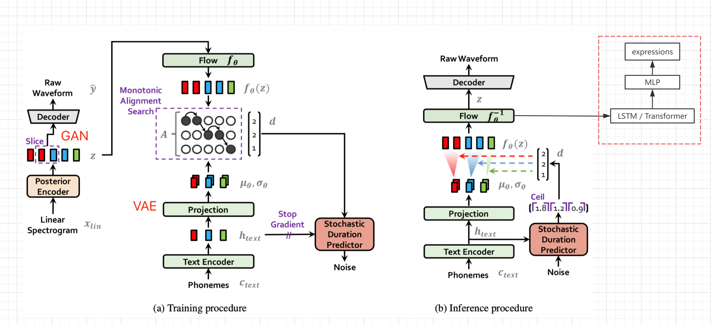

# 简介
* 本项目的目的是拓展[Bert-VITS2](https://github.com/fishaudio/Bert-VITS2)的使用边界，比如TTS同步产生脸部表情数据。
* 效果参见
  * Demo [哔哩哔哩](https://www.bilibili.com/video/BV16V411Q7LM/)  [Youtube](https://youtu.be/Pvnqmk0cd_4)
  * [TTS with Audio2PhotoReal --> MetaHuman](https://www.bilibili.com/video/BV1dg4y1m7sX/)
  * [从歌声生成表情测试；与Azure TTS说话时的表情对比](https://www.bilibili.com/video/BV16W4y1P73h/)
  * [TTS生成表情初版，与MotionGPT拟合](https://www.bilibili.com/video/BV1s64y1H7ij/)   


# TTS

* TTS代码源自 [Bert-VITS2](https://github.com/fishaudio/Bert-VITS2) v2.3 Final Release [ Dec 20, 2023]
  * https://github.com/fishaudio/Bert-VITS2/commit/7ebc1aa28a055608f7e31da93928cf295fdffeba

* 测试下来，个人感觉纯中文素材的训练效果2.1-2.3版本略微不如1.0，纯中文需求可以考虑降低版本或混合使用。

* TTS本身的训练方法见原文(每个版本都有所不同)
  * 1.0版本推荐参考 https://github.com/YYuX-1145/Bert-VITS2-Integration-package


# TTS同步输出表情
## 思路
* 参考[VITS](https://arxiv.org/pdf/2106.06103.pdf)论文的网络结构图(非bert-vits2，但大体结构是一样的)，获取文本编码及变换后、解码前的隐变量z，从旁路输出表情值(Live Link Face数值)
  * 冻结原网络的参数，单独增加一路LSTM和MLP处理，完成z到表情的seq2seq生成与映射
  * 当然如果有高质量的表情数据，也可以把表情也加入原始TTS网络训练，应该能提高音频质量




## 数据采集
* 设置Live Link Face 的Targets 为本机IP，端口默认11111 
* 同步采集语音和对应的Live Link输出的表情值，分别存入到records文件夹
  * 执行一下脚本采集，每次20秒
  * 音频默认为44100 Hz
  * 音频、表情的采集可能有偏移
  * 可对比验证集的损失找到同一数据源的最佳偏移位置
```
python ./motion/record.py
```

* 查看数据是否正常
  * [预览npy中的weight数值曲线](./motion/data.ipynb)

* 测试数据
  * 将录下的bs数据通过live link发给UE中的MetaHuman，同步播放语音，检查是否匹配
```
python ./motion/tts2ue.py --bs_npy_file  ./records/2023-12-23-17-19-54.npy --wav_file ./records/2023-12-23-17-19-54.wav  --fps 60
```

## 数据预处理
* 读取records中的所有音频文件，利用后验编码器，把音频编码后的隐变量z存入 *.z.npy
* 写入训练和验证用的文件列表
  * filelists/val_visemes.list
  * filelists/train_visemes.list
```
python ./motion/prepare_visemes.py
```

## 训练
* 在train_ms.py 后加上--visemes来区别和主网的训练
```
python train_ms.py  -m OUTPUT_MODEL --config ./configs/config.json --visemes
```

## 推理
* 在webui.py执行时，将输出的音频、隐变量、动画数据写入当前目录，可用tts2ue.py来查看生成效果
* 生成的动画默认的fps是和隐变量一样的86.1328125
  * 44100/86.1328125 = 512，刚好整除，这是Bert-VITS2音频采样频率、网络结构和hidden_channels决定的
```
python ./motion/tts2ue.py --bs_npy_file ./tmp.npy --wav_file ./tmp.wav --delay_ms 700
```

# 声音到表情
* 利用后验编码器，把声音转换成z，然后再把z转成表情
  * 音频需转成44100hz的wav文件，并只保留一个通道(ffmpeg)
```
# 音频截取转换
ffmpeg -i input_file -ss 00:00:00 -t 00:00:10 -ar 44100 -f wav test.wav

# 保留通道1
ffmpeg -i test.wav -map_channel 0.0.0 output.wav

python  ./motion/wav_to_visemes.py output.wav
```


# 身体动画

## MotionGPT

* 有了语音和表情后，还可以在LLM驱动下产生与之匹配的动作描述，然后用text to motion模型生成与说话内容匹配的身体动画，甚至和场景、他人进行交互。
* text to motion测试采用的项目是 [MotionGPT](https://github.com/OpenMotionLab/MotionGPT)
  * 暂未做动画过度处理，看介绍模型是支持的 [motion in-between](https://motion-gpt.github.io/)
  * MotionGPT用的flan-t5-base，不能理解中文，所以无法用说话的文本产生同步度很高的动画(翻译成英文后语序多少有些变化) 
    * 是否可以用说话的文本或隐变量z来指导动作生成暂未可知
* MotionGPT输出的是骨骼位置，与UE的骨骼动画不能直接对接
  * 目前用了简化方法估算运动数值，会有不小的位置损失
    * 计算出骨骼相对父节点的旋转变化量(四元数)
      * 参考 [代码](motion/vmc_cli.py)
    * 通过OSC协议发送给 [VMCtoMOP](https://github.com/HAL9HARUKU/VMCtoMOP)程序，可预览动画，并做协议转换
    * 借助[Mop插件](https://github.com/HAL9HARUKU/MopUE4)将MOP数据映射给MetaHuman
      * 测试版本是UE5.3

## audio2photoreal
* 在原项目的基础上修改，Web界面推理时导出动画数据到本地文件
  * [导出过程](https://github.com/see2023/audio2photoreal/blob/main/test.ipynb)
  * 代码 https://github.com/see2023/audio2photoreal


# Bert-VITS2 原版声明

<div align="center">


VITS2 Backbone with multilingual bert

For quick guide, please refer to `webui_preprocess.py`.

简易教程请参见 `webui_preprocess.py`。

## 请注意，本项目核心思路来源于[anyvoiceai/MassTTS](https://github.com/anyvoiceai/MassTTS) 一个非常好的tts项目
## MassTTS的演示demo为[ai版峰哥锐评峰哥本人,并找回了在金三角失落的腰子](https://www.bilibili.com/video/BV1w24y1c7z9)

[//]: # (## 本项目与[PlayVoice/vits_chinese]&#40;https://github.com/PlayVoice/vits_chinese&#41; 没有任何关系)

[//]: # ()
[//]: # (本仓库来源于之前朋友分享了ai峰哥的视频，本人被其中的效果惊艳，在自己尝试MassTTS以后发现fs在音质方面与vits有一定差距，并且training的pipeline比vits更复杂，因此按照其思路将bert)

## 成熟的旅行者/开拓者/舰长/博士/sensei/猎魔人/喵喵露/V应当参阅代码自己学习如何训练。

### 严禁将此项目用于一切违反《中华人民共和国宪法》，《中华人民共和国刑法》，《中华人民共和国治安管理处罚法》和《中华人民共和国民法典》之用途。
### 严禁用于任何政治相关用途。
#### Video:https://www.bilibili.com/video/BV1hp4y1K78E
#### Demo:https://www.bilibili.com/video/BV1TF411k78w
## References
+ [anyvoiceai/MassTTS](https://github.com/anyvoiceai/MassTTS)
+ [jaywalnut310/vits](https://github.com/jaywalnut310/vits)
+ [p0p4k/vits2_pytorch](https://github.com/p0p4k/vits2_pytorch)
+ [svc-develop-team/so-vits-svc](https://github.com/svc-develop-team/so-vits-svc)
+ [PaddlePaddle/PaddleSpeech](https://github.com/PaddlePaddle/PaddleSpeech)
+ [emotional-vits](https://github.com/innnky/emotional-vits)
+ [fish-speech](https://github.com/fishaudio/fish-speech)
+ [Bert-VITS2-UI](https://github.com/jiangyuxiaoxiao/Bert-VITS2-UI)
## 感谢所有贡献者作出的努力
<a href="https://github.com/fishaudio/Bert-VITS2/graphs/contributors" target="_blank">
  
</a>
